# Cloud Computing - Laboratory 03: Auto scaling an App on Amazon Web Services

Author : Baptiste Hardrick & David Jaquet

## Observation of the Auto Scaling Group behavior

After our Auto Scaling Group created, the group has no instances started. To have 1 instance, we have to stop the Instance created. When we try to stop the instance AWS could not get the instance status as you can see in the screenshot below.

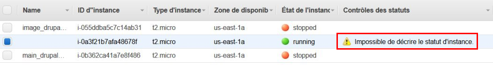

However, in our Auto Scaling Group, we can see that we have 1 instance started.

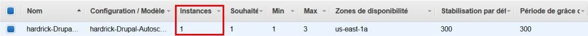

If we return in our instances list, we can see that the instance is well stopped. We can conclude that the problem mentionned before is only a reloading problem.

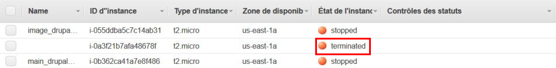

One our Auto Scaling Group settled, we execute the command `while true; do sysbench cpu --cpu-max-prime=20000 --threads=4 --time=60 run; done`. With these instructions, the load of the instance will increase and the Auto Scaling Group will create some new instances. We can see the creation of the instances in the screenshot below.

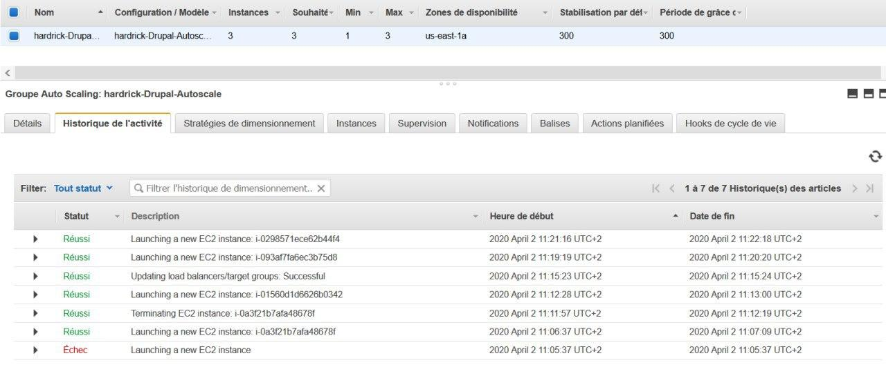

We can see there was a failure to create a new instance, but in the end, we have our 3 instances as requested in our Auto Scaling Group. In the order, the instances were created in this order (we do not write the one terminating here) :

1. `i-01560d1d6626b0342`
2. `i-093af7fa6ec3b75d8`
3. `i-0298571ece62b44f4`

A better view of the instances is available below. Obviously, the instances created by the Auto Scaling Group are the 3 in the state **running**.

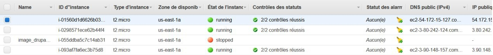

In the two screenshots below, we can see an important usage of the CPU, some big values for the network traffic. The network values decrease quickly. This change come from the creation of the instances by the Auto Scaling Group.

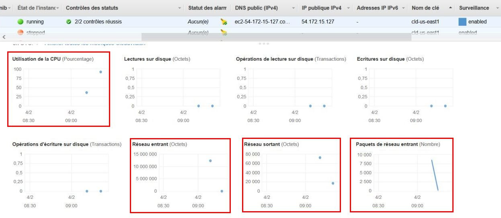

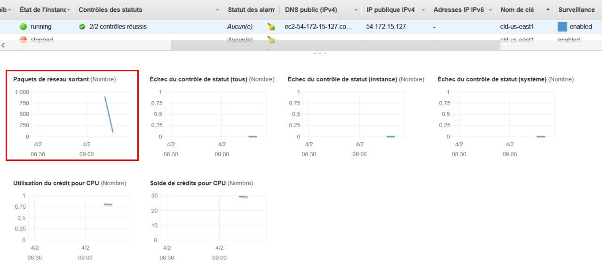

After these informations took, we interrupt the loop describe early to watch the instances being terminated. In the screenshot below, we can see the first instance created is already terminated and the second one is shutting down. The network informations are decreasing because no new requests are incoming.

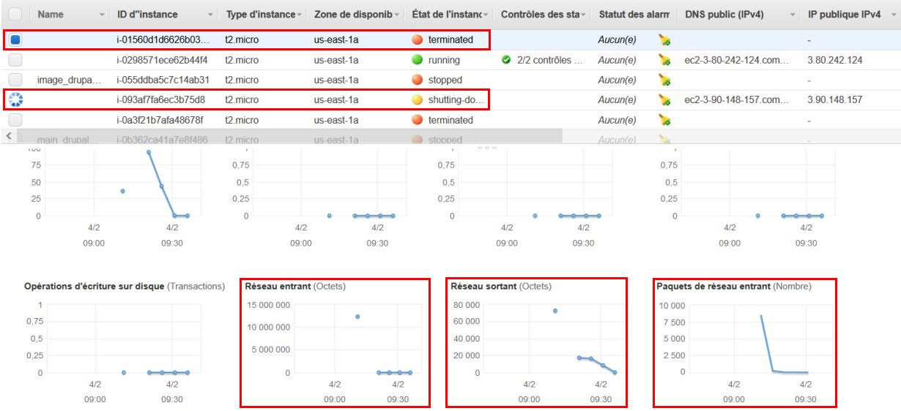

In the screenshot below, we can see our last instance running. The CPU usage is now at the minimum and we can notice that the last instance running is the last created by the Auto Scaling Group. 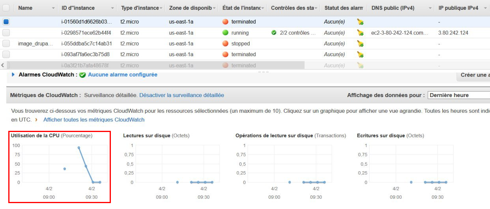

We can see below the instances being terminated to finally have only one instance. The screenshots below are the details of the Auto Scaling Group and the number total of capacity and instances do not have been updated.

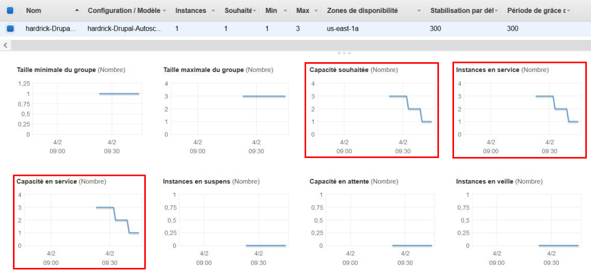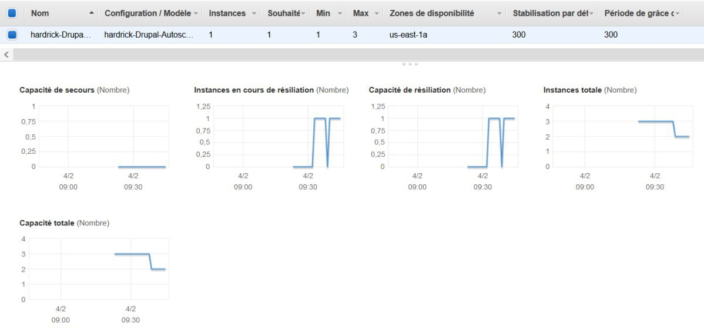